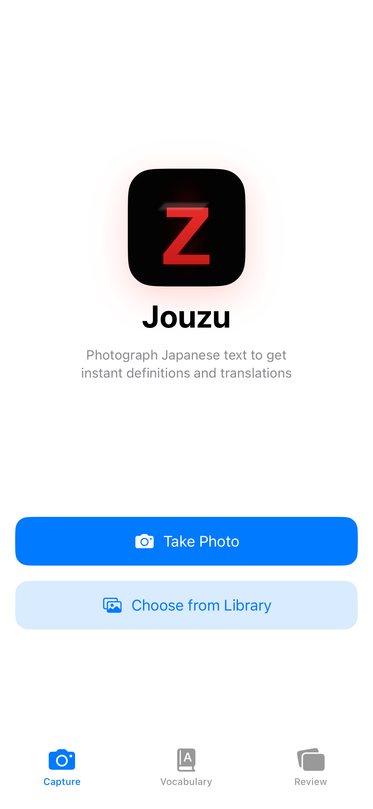
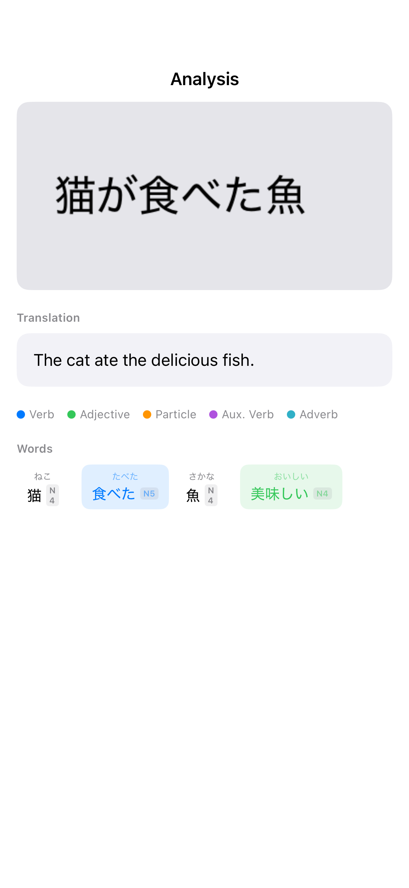
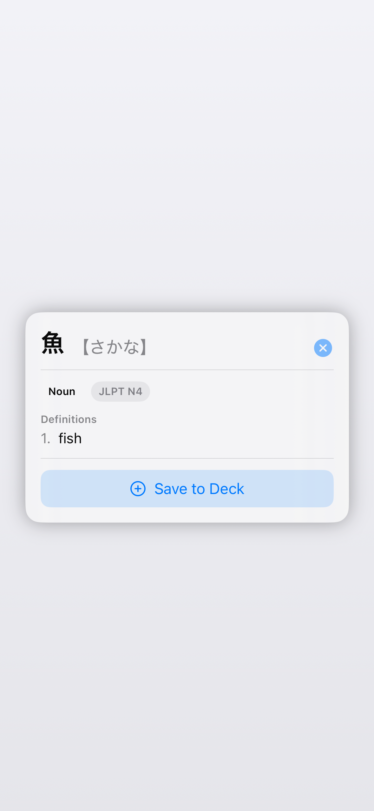
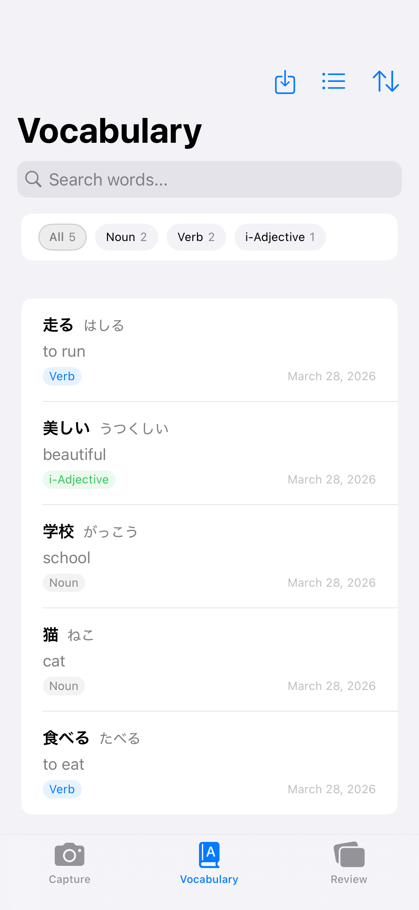
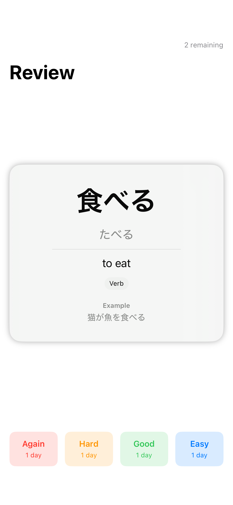

# Jouzu - Japanese Flashcard App with Camera OCR

Learn Japanese by snapping photos of real-world text.

> **Note:** This project is a work in progress. Features and APIs may change.

Jouzu is an iOS app that helps you learn Japanese from real-world text. Snap a photo of signs, menus, or books — or upload your own study list — and the app breaks the text into words with instant definitions, readings, and grammar notes.

## Features

- **Camera OCR** - Recognize Japanese text from photos using the Vision framework
- **Tokenization + filtering** - Split text with MeCab, then keep Japanese words only (non-Japanese tokens removed)
- **Unique words view** - Analysis shows unique vocabulary only, with grammar-only tokens hidden
- **Clean English translation** - Analysis shows a cleaned full-text English translation when available
- **Color-coded grammar** - Parts of speech highlighted at a glance for visible words
- **JLPT badges** - Word chips and detail popovers show JLPT levels when available
- **Bundled dictionary lookup** - A bundled JMdict subset provides broad offline definition coverage
- **On-device translation fallback** - Translation framework backfills only unresolved word definitions
- **Non-blocking analysis flow** - Switching photos no longer waits on translation to finish before opening Analysis
- **Spaced repetition** - Save vocabulary to a built-in review system using the SM-2 algorithm

## Recent Changes (March 28, 2026)

- Fixed the photo-switching flow so a second upload does not get stuck on "Analyzing text..."
- Added cleaned full-text English translation to the Analysis screen
- Updated **Words** to show unique vocabulary only and hide single-character hiragana / grammar tokens
- Bundled a JMdict subset so most words resolve locally before translation fallback is needed
- Added JLPT level support to dictionary data plus visible N-level badges in analysis chips and word details
- Built out the vocabulary and review flows so saved words can be studied in-app

## Screenshots

<p align="center">
  
  
  
</p>
<p align="center">
  
  
</p>

README screenshots are generated by `JouzuTests/ScreenshotTests.swift`, which renders stable iPhone-sized SwiftUI snapshots into `Screenshots/`.

## Requirements

- iOS 18.0+
- Xcode 16+
- Swift 6.0

## Build

```bash
# Regenerate the Xcode project
xcodegen generate

# List available run destinations on your machine
xcodebuild -scheme Jouzu -showdestinations

# Build using one of the listed destinations
xcodebuild -scheme Jouzu -configuration Debug -destination 'platform=iOS Simulator,name=iPhone 16' build

# Or open Jouzu.xcodeproj in Xcode and hit Run
```

## Architecture

MVVM with feature-based modules. The processing pipeline:

```text
Camera -> OCR (Vision) -> Tokenize (MeCab) -> Filter -> Dictionary -> Grammar -> Show Analysis -> Optional translation enrichment
```

Analysis opens as soon as OCR/tokenization/dictionary work completes. Full-text translation and unresolved word-definition fallback continue in the background and update the visible analysis in place.

Each feature (Camera, Analysis, Vocabulary, Review) has its own View + ViewModel pair under `Jouzu/Features/`.

## Dependencies

- [MeCab-Swift](https://github.com/shinjukunian/Mecab-Swift.git) - Japanese morphological analysis with bundled IPA dictionary
- [JMdict](https://www.edrdg.org/jmdict/j_jmdict.html) - dictionary data source

## Dictionary Data Behavior

`DictionaryService` first attempts to load a bundled `jmdict.sqlite` file generated from JMdict priority-tagged entries. If it is not present, the app falls back to an in-memory development dictionary with seeded common entries.

To regenerate the bundled subset after downloading the official source:

```bash
python3 scripts/build_jlpt_map.py --input-dir /path/to/jlpt-csvs --output scripts/jlpt_levels.json
python3 scripts/generate_jmdict_subset.py --input /path/to/JMdict_e.gz --jlpt-map scripts/jlpt_levels.json --output Jouzu/Resources/jmdict.sqlite
```

## Contributing

This repository is maintained as an Xcode/XcodeGen iOS app project. Use Xcode or `xcodebuild` for local development.

## License

[MIT](LICENSE)
