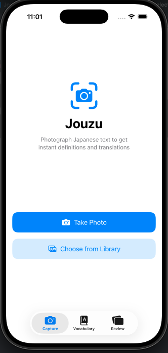

# Jouzu - Japanese Flashcard App with Camera OCR

Learn Japanese by snapping photos of real-world text.

> **Note:** This project is a work in progress. Features and APIs may change.

Jouzu is an iOS app that helps you learn Japanese from real-world text. Snap a photo of signs, menus, or books — or upload your own study list — and the app breaks the text into words with instant definitions, readings, and grammar notes.

## Features

- **Camera OCR** - Recognize Japanese text from photos using the Vision framework
- **Tokenization** - Split text into words with MeCab morphological analysis
- **Color-coded grammar** - Parts of speech highlighted at a glance (nouns, verbs, particles, etc.)
- **Dictionary lookup** - Tap any word for definitions, readings, and inflection details
- **On-device translation** - Full sentence translation via Apple's Translation framework
- **Spaced repetition** - Save vocabulary to a built-in review system using the SM-2 algorithm

## Screenshots

<p align="center">
  
  <br>
  <em>Work in progress</em>
</p>

## Requirements

- iOS 18.0+
- Xcode 16+
- Swift 6.0

## Build

```bash
# Regenerate the Xcode project
xcodegen generate

# List available run destinations on your machine
xcodebuild -scheme Jouzu -showdestinations

# Build using one of the listed destinations
xcodebuild -scheme Jouzu -configuration Debug -destination 'platform=iOS Simulator,name=iPhone 16' build

# Or open Jouzu.xcodeproj in Xcode and hit Run
```

## Architecture

MVVM with feature-based modules. The processing pipeline:

```text
Camera -> OCR (Vision) -> Tokenize (MeCab) -> Dictionary -> Grammar -> Translate -> Display
```

Each feature (Camera, Analysis, Vocabulary, Review) has its own View + ViewModel pair under `Jouzu/Features/`.

## Dependencies

- [MeCab-Swift](https://github.com/shinjukunian/Mecab-Swift.git) - Japanese morphological analysis with bundled IPA dictionary
- [JMdict](https://www.edrdg.org/jmdict/j_jmdict.html) - dictionary data source

## Dictionary Data Behavior

`DictionaryService` first attempts to load a bundled `jmdict.sqlite` file. If it is not present, the app falls back to an in-memory development dictionary with seeded common entries.

## Contributing

This repository is maintained as an Xcode/XcodeGen iOS app project. Use Xcode or `xcodebuild` for local development.

## License

[MIT](LICENSE)
